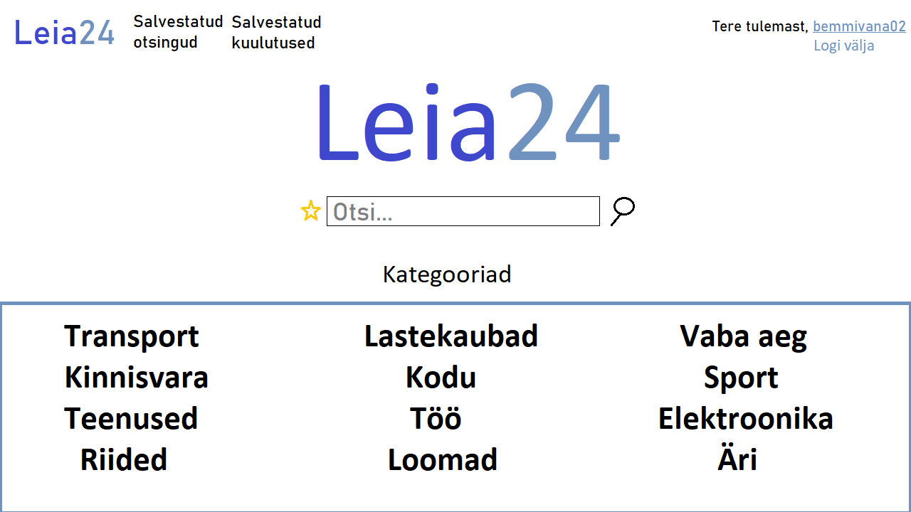
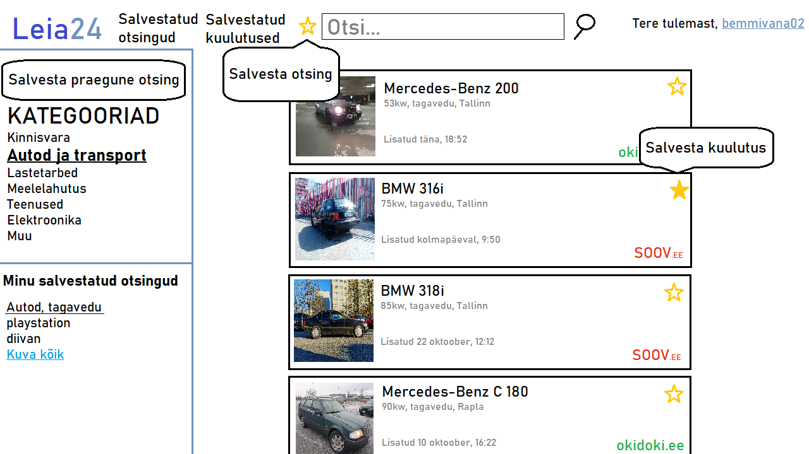

## Projekti nimi

Leia24

## Kirjeldus

Projekti mõte on kõik kuulutused soov.ee ja okidoki.ee lehelt ühte kohta paigaldada, et ei peaks eraldi neid lehti läbi uurima. Potensiaalselt võiks lisada ka osta.ee lehe aga selleks peab loa hankima.
Lehel on sirvijal võimalik sisestada märksõna, mille abil otsib meie lehekülg kõik seda märksõna sisaldavad kuulutused. Samuti proovime saada ka kõik pildid mida kuulutus sisaldab enda lehele. Kui tekib huvi leitud asja vastu, on võimalik kasutajal lingi peale vajutades kuulutuse õige asukoha juurde minna.
Tekitame ka kasutaja loomise võimaluse. Kasutaja loomisel ja sellega sisselogimisel on võimalik märkida kuulutusi “meeldivate” hulka ja neid pärast eraldi vaadata. Samuti jätab lehekülg meelde kasutaja viimati otsitud märksõnad. Ehk searchbar-ile vajutades tekib list eelmistest otsitud märksõnadest.

### Autorid: Aron Paco Vunk, Aksel Talvoja, Evelin Otsa

## Funktsionaalsused

1. Kuulutuste otsimine märksõna(de) järgi
2. Kuulutuste otsimine kategooria järgi (~12 kategooriat)
3. Kuulutuse salvestamine
4. Salvestatud kuulutuste kuvamine kasutaja lehel
5. Otsingu salvestamine (märksõnade, kategooriate ja/või filtrite järgi)
6. Salvestatud otsingute kuvamine kasutaja lehel
7. Kuulutuste peale vajutades kuulutuse õigele lehele edasi saatmine
8. Kuulutuste piltide kuvamine ka meie lehel, või siis ühe pildi suurendamine
9. Kasutaja loomine
10. Lehele sisse logimine

## Wireframe

Avaleht

Kasutaja leht

Otsing

